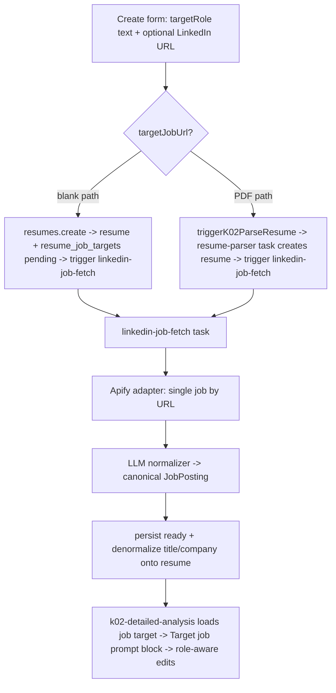

# 2026-06-23 00:08 — Resume creation flow: LinkedIn job-URL context for AI suggestions

## Goal

Let the resume **creation flow** (`apps/web/src/components/domains/resumes/`) capture the role the user is
applying for **as a LinkedIn job URL**, fetch that job's details in the background, sync them to the resume,
and feed them into the AI so its suggestions are tailored to the target role ("knows what to suggest").
The creation UX must also make the **best path explicit**: users can paste a LinkedIn job **and** upload their
existing resume PDF in the same flow so Casey imports it first, then improves/suggests changes for that role.

## Decisions locked (by the user)

- **Two separate fields** in the create form: keep the existing free-text "Puesto objetivo" (`targetRole`)
  AND add an optional "Enlace de la oferta (LinkedIn)" (`targetJobUrl`). Not a single smart field.
- **New UX requirement (2026-06-23):** do **not** present LinkedIn job context and PDF upload as alternatives.
  The primary/recommended path is **LinkedIn job URL + current resume PDF**. Blank creation and PDF-only import
  remain supported fallbacks.
- **Provider: Apify** — single-job-detail actor (NOT a search/list scraper). Behind a swappable adapter.
- **No tests.** Do not add any `*.test.*` files (also a standing repo preference).
- (My calls, documented inline) Parser extraction stays role-agnostic; role-awareness lives in the
  **analysis** (suggestion) layer. **Fast analysis injection was dropped** — it runs pre-resume in
  onboarding (`setup.tsx`) where no resume/job-target exists yet, so there is no data path to it; adding it
  would be dead code.

## Confirmed library versions (verify any new API against these)

`ai@6.0.204` · `@trigger.dev/sdk@4.4.6` · `drizzle-orm@0.45.2` · `drizzle-zod@0.8.3` · `zod@4.4.3`

Gotchas these forced (already applied):
- **zod v4**: use top-level `z.url()` / `z.email()`. `z.string().url()` is deprecated — do not use it.
  `linkedinJobUrlSchema` validates via a `.refine()` that calls `parseLinkedinJobId` (which runs `new URL()`
  + host check), so no `.url()` method is needed.
- **AI SDK v6 / repo convention**: structured output uses `streamText({ output: Output.object({ schema }) })`
  then `await result.output`. The repo does NOT use `generateObject` — the normalizer was rewritten to match.
- Message `content` is a **parts array** (`[{ type: "text", text }]`), and Gemini calls pass
  `providerOptions.google.thinkingConfig = { thinkingBudget: 0, includeThoughts: false }`.

## Architecture



Data model: one `resume_job_targets` row per resume (unique on `resumeId`), status
`pending -> fetching -> ready | failed`. `structured` holds the canonical `JobPosting`
(responsibilities/qualifications/skills/keywords/summary). On `ready`, `title`→`resumes.targetRole`
(only if empty) and `company`→`resumes.targetedCompanyIdentifier` are denormalized so the card subtitle and
analyses read them cheaply. A failed/absent fetch never breaks resume creation.

## Status

> **Update 2026-06-23:** Phases 5–7 are complete in code. The creation flow now frames LinkedIn job URL + current
> resume PDF as the recommended path, keeps LinkedIn-only/PDF-only/blank fallbacks visible, and preserves the
> existing validation and quota behavior.

| Phase | State |
|---|---|
| 1. Foundation (db table, schemas, URL parser, input threading) | ✅ done |
| 2. Background task (env, Apify adapter, normalizer, task, queue) | ✅ done |
| 3. API wiring (create trigger, getJobTarget, list status, parser path) | ✅ done |
| 4. AI context (helper + detailed-analysis injection) | ✅ done |
| 5. Web UI (form fields, card badge, editor note) | ✅ done |
| 6. Verification (typecheck + ultracite) | ✅ done |
| 7. Creation-dialog UX clarification (`resume-create-dialog.tsx` + form copy) | ✅ done |

Verification results for Phases 1–7: `schemas` tsc clean; `jobs`/`api` tsc clean except the pre-existing
`transactional` React-types breakage; `apps/web` tsc adds **zero** new errors (the 11 remaining are pre-existing
in untouched files: `transactional/*`, `shimmer.tsx`, `otp-field.tsx`, `letters/*`). Ultracite
check passes on all touched files. Nothing committed; all changes are in the working tree.
External prerequisites also remain: set `APIFY_TOKEN` and run the DB migration. See "Prerequisites" below.

## Phase 7 — Creation-dialog UX clarification ✅ DONE

### User feedback

`apps/web/src/components/domains/resumes/resume-create-dialog.tsx` is confusing. The modal currently says:

- Title without parser run: `Nuevo CV`
- Description without parser run: `¿Para qué puesto es este CV? Sube un PDF o créalo en blanco.`
- Title during parser run: `Importando CV`
- Description during parser run: `Estamos analizando tu PDF. Puedes cerrar este panel, seguirá en segundo plano.`

Problem: the copy makes the flow feel like separate choices ("LinkedIn role" vs "PDF upload" vs "blank"),
but users **will want to paste a LinkedIn job and upload their existing resume PDF** so the AI can import the
resume and later tailor suggestions to the actual job.

### UX direction

Make the combined path the default mental model:

1. **Recommended:** paste LinkedIn job URL + upload current CV PDF.
   - Backend already supports this: `ResumeCreateForm` forwards `targetJobUrl` into `triggerK02ParseResume`,
     and the parser task creates the resume before starting `linkedin-job-fetch`.
   - Expected user promise: "Casey imports your CV now; job details sync in the background; suggestions in the
     editor are tailored to that role."
2. **LinkedIn URL + blank CV:** supported via `resumes.create({ targetJobUrl })`.
3. **PDF only:** supported; imports a resume without job-specific context.
4. **Blank only / free-text role:** supported fallback.

Do **not** split the UI into mutually-exclusive modes unless the data contract changes. The current form already
supports combining URL + upload; the problem is framing/copy/visual hierarchy.

Follow-up UX refinement: avoid numbered steps because PDF selection starts a separate import flow. The form now
frames LinkedIn and PDF as **tools available before continuing**, not a sequence. PDF upload no longer auto-starts
on file selection; the user chooses the file, reviews the LinkedIn context, then clicks `Continuar con este PDF`.

### Proposed changes

- `resume-create-dialog.tsx`
  - Change idle title from `Nuevo CV` to something like `Crear o mejorar tu CV`.
  - Change idle description to explicitly recommend the combined path, e.g.
    `Pega una oferta de LinkedIn y sube tu CV actual para que Casey lo importe y prepare sugerencias para ese puesto. También puedes usar solo una opción.`
  - Change parser title from `Importando CV` to `Importando tu CV`.
  - Change parser description to mention job syncing when present, e.g.
    `Estamos analizando tu PDF. Si pegaste una oferta de LinkedIn, también sincronizaremos ese puesto para personalizar las sugerencias. Puedes cerrar este panel; seguirá en segundo plano.`
  - Consider passing a small `hasTargetJobUrl`/`flowContext` state from `ResumeCreateForm` to the dialog when parse starts if copy should be precise instead of generic. Today `onParseStart(runId)` only passes the run id.
- `resume-create-form.tsx`
  - Reframe the existing fields as available tools instead of a numbered wizard:
    - Add a compact intro/callout: LinkedIn gives Casey job context; PDF gives Casey the user's current
      experience.
    - Label the LinkedIn URL as recommended context, not "step 1".
    - Label the PDF dropzone as current-CV import, not "step 2".
    - Disable Dropzone `autoUpload`; PDF parsing starts only after the user clicks `Continuar con este PDF`.
    - Keep `Crear CV en blanco` as a secondary fallback for users without a PDF.
  - Preserve semantic HTML and avoid nested wrappers where one semantic element can carry the class names.
  - Keep invalid LinkedIn URL behavior: it must block both blank creation and upload.
- Optional polish:
  - Use small badges like `Recomendado` / `Opcional`, not bold weights.
  - Add a short four-path helper list only if it reduces confusion:
    `LinkedIn + PDF`, `LinkedIn + blanco`, `PDF solo`, `Blanco`.

### Acceptance criteria

- A user can clearly understand that LinkedIn URL + resume PDF is the recommended flow.
- Pasting a valid LinkedIn job URL, attaching a PDF, and clicking `Continuar con este PDF` still calls `triggerK02ParseResume` with `targetJobUrl`.
- Pasting a valid LinkedIn job URL and clicking blank creation still calls `resumes.create` with `targetJobUrl`.
- PDF-only and blank-only paths still work.
- Invalid LinkedIn URL blocks both actions with the existing field error.
- Quota warning still blocks AI/PDF upload when quota is exhausted but does **not** imply LinkedIn URL or blank
  creation is unavailable.
- Run `pnpm dlx ultracite check` on touched files and `cd apps/web && pnpm exec tsc --noEmit`; if global web
  tsc still fails, confirm no errors are in the files touched for Phase 7.

## Files done (reference by path — do not re-paste)

**packages/db**
- `src/schema/resume-job-targets.ts` — new table + relations (status enum, denormalized cols, `structured` JSON).
- `src/schema/index.ts` — exports the new table.
- `src/schema/resumes.ts` — added `jobTarget` one-relation.
- `src/migrations/0023_aberrant_maggott.sql` (+ meta snapshot) — generated, **NOT pushed** (see Prerequisites).

**packages/schemas**
- `src/db/resume-job-targets.ts` — drizzle-zod select/insert/update + status enum re-export.
- `src/jobs/linkedin-job-fetch.ts` — canonical `jobPostingSchema` (`.describe()` per field), task input schema, step enum.
- `src/api/resumes.ts` — `parseLinkedinJobId`, `linkedinJobUrlSchema`, `createResumeInputSchema.targetJobUrl`,
  `resumeListItemSchema.jobTargetStatus`.
- `src/api/agents.ts` — `triggerResumeParserInputSchema.targetJobUrl`.
- `src/jobs/resume-parser.ts` — `resumeParserInputSchema.targetJobUrl`.

**packages/env**
- `src/server.ts` — `APIFY_TOKEN` (optional), `APIFY_LINKEDIN_JOB_ACTOR` (optional).

**packages/jobs**
- `src/lib/linkedin/fetch-job.ts` — Apify adapter (`run-sync-get-dataset-items`, input `{ job_urls: [url] }`,
  returns the first dataset item raw). `LinkedinJobConfigError` (no-retry) vs `LinkedinJobFetchError` (retry).
- `src/agents/linkedin-job-normalizer.handler.ts` — `streamText` + `Output.object(jobPostingSchema)` normalizer.
- `src/trigger/tasks/linkedin-job-fetch.ts` — the task (`pending→fetching→normalizing→persisting`, denormalize,
  `onFailure` marks `failed`, `AbortTaskRunError` for missing token).
- `src/trigger/queues.ts` — `linkedinJobQueue`.
- `src/lib/resume-job-target.ts` — `getResumeJobTarget(resumeId, userId)` + `buildJobTargetContextText(...)`.
- `src/agents/k02-detailed-analysis.handler.ts` — accepts `jobTargetText`, injects a "Target job" content part.
- `src/trigger/tasks/k02-detailed-analysis.ts` — loads the job target and passes `jobTargetText`.
- `src/trigger/tasks/resume-parser.ts` — after creating the resume, inserts `resume_job_targets` + triggers
  `linkedin-job-fetch` when `payload.targetJobUrl` is present (best-effort).

**packages/api**
- `src/routers/resumes.ts` — `create` inserts the job-target row + triggers the fetch (returns `jobTarget`
  `{ id, runId, publicAccessToken }`); `list` attaches `jobTargetStatus`; new `getJobTarget` query.
- `src/routers/agents.ts` — `triggerK02ParseResume` forwards `targetJobUrl` to the parser task.

## Phase 5 — Web UI ✅ IMPLEMENTED (2026-06-23)

> Done in this session. The snippets below are kept as a record of intent; the actual applied code lives in the
> three files named. Two refactors were made during implementation to satisfy ultracite (no `biome-ignore`):
> the LinkedIn regexes were hoisted to module-level constants in `schemas/api/resumes.ts`; the parser-task
> job-fetch kickoff was extracted to a `kickoffLinkedinJobFetch` helper; and the editor note was extracted to a
> `ResumeJobTargetNote` component to keep `ResumeAnalysisSection` under the cognitive-complexity limit.

### 5a. `apps/web/src/components/domains/resumes/resume-create-form.tsx`

1. Import the parser:
   `import { createResumeInputSchema, parseLinkedinJobId } from "@stackk-career/schemas/api/resumes";`
2. Add two top-level helpers near `parseTargetRole` (multi-statement — OK vs the no-tiny-functions rule):
   ```ts
   const parseJobUrl = (value: string): string | undefined => {
     const trimmed = value.trim();
     if (!trimmed) {
       return;
     }
     const parsed = createResumeInputSchema.shape.targetJobUrl.safeParse(trimmed);
     return parsed.success ? parsed.data : undefined;
   };

   const validateJobUrl = (value: string): string | undefined => {
     const trimmed = value.trim();
     if (!trimmed) {
       return;
     }
     return parseLinkedinJobId(trimmed)
       ? undefined
       : "Pega el enlace de una oferta de LinkedIn (ej. linkedin.com/jobs/view/...)";
   };
   ```
3. `useForm` (≈63-70): `defaultValues` add `targetJobUrl: ""`; `onSubmit` →
   `createBlankMutation.mutate({ targetRole: parseTargetRole(value.targetRole), targetJobUrl: parseJobUrl(value.targetJobUrl) })`.
4. After the `targetRole` `form.Field` (≈99) add a new field (use `FieldError` from `@/components/ui/field`
   for the error, `FieldDescription` for the hint):
   ```tsx
   <form.Field
     name="targetJobUrl"
     validators={{ onChange: ({ value }) => validateJobUrl(value), onBlur: ({ value }) => validateJobUrl(value) }}
   >
     {(field) => {
       const error = field.state.meta.errors[0];
       const hasValue = field.state.value.trim().length > 0;
       return (
         <Field>
           <FieldLabel htmlFor="resume-target-job-url">Enlace de la oferta (LinkedIn)</FieldLabel>
           <Input
             disabled={createBlankMutation.isPending || parseMutation.isPending}
             id="resume-target-job-url"
             inputMode="url"
             onBlur={field.handleBlur}
             onChange={(e) => field.handleChange(e.target.value)}
             placeholder="https://www.linkedin.com/jobs/view/..."
             value={field.state.value}
           />
           {error ? (
             <FieldError>{error}</FieldError>
           ) : (
             <FieldDescription>
               {hasValue
                 ? "Buscaremos los detalles del puesto en segundo plano para personalizar las sugerencias."
                 : "Opcional. Pega la oferta de LinkedIn y adaptaremos las sugerencias al puesto."}
             </FieldDescription>
           )}
         </Field>
       );
     }}
   </form.Field>
   ```
   (Import `FieldError` alongside the existing `Field, FieldDescription, FieldLabel`.)
5. Submit button subscribe (≈101-108) — gate on validity so an invalid URL blocks submit:
   ```tsx
   <form.Subscribe selector={(state) => ({ isSubmitting: state.isSubmitting, canSubmit: state.canSubmit })}>
     {({ isSubmitting, canSubmit }) => (
       <Button disabled={!canSubmit || isSubmitting || createBlankMutation.isPending || parseMutation.isPending} type="submit">
         {isSubmitting && <Loader />}
         Crear desde cero
       </Button>
     )}
   </form.Subscribe>
   ```
6. Dropzone subscribe (≈128-151) — select whole `values`, compute and forward the URL, block AI upload when invalid:
   ```tsx
   <form.Subscribe selector={(state) => state.values}>
     {(values) => {
       const parsedRole = parseTargetRole(values.targetRole);
       const parsedJobUrl = parseJobUrl(values.targetJobUrl);
       const jobUrlInvalid = values.targetJobUrl.trim().length > 0 && !parsedJobUrl;
       const isBusy = createBlankMutation.isPending || parseMutation.isPending;
       return (
         <Dropzone<{ generationId: string | undefined }>
           autoUpload
           disabled={isBusy || !canUseAi || jobUrlInvalid}
           endpoint="resumeUploader"
           input={{ generationId: undefined }}
           onClientUploadComplete={(files) => {
             const fileId = files.at(0)?.serverData.storedId;
             if (!fileId) {
               toast.error("No pudimos registrar el archivo. Intenta de nuevo.");
               return;
             }
             parseMutation.mutate({ fileId, displayName: parsedRole, targetJobUrl: parsedJobUrl });
           }}
           onUploadError={(err) => toast.error(err.message)}
         />
       );
     }}
   </form.Subscribe>
   ```

`resume-create-dialog.tsx` originally needed no data-plumbing change — the new `create` return (`jobTarget`) is
additive and the flow navigates to the editor as before. **Superseded UX note:** user feedback now requires
copy/layout improvements in the dialog/form so the combined LinkedIn URL + PDF upload path is obvious.

### 5b. `apps/web/src/components/domains/resumes/resume-card.tsx`

`resume.jobTargetStatus` is now on `ResumeListItem`. Add a badge in the tags `<ul>` (after the `agentCreated`
badge, ≈93). Suggested: while `pending`/`fetching` show "Buscando puesto…"; on `failed` optionally a muted
"Puesto no encontrado". Card currently imports phosphor icons (`ArrowRightIcon, SparkleIcon, StarIcon`) — add a
phosphor icon (e.g. `MagnifyingGlassIcon`) rather than pulling in lucide.
```tsx
{(resume.jobTargetStatus === "pending" || resume.jobTargetStatus === "fetching") && (
  <li>
    <Badge size="sm" variant="secondary">
      <MagnifyingGlassIcon />
      Buscando puesto…
    </Badge>
  </li>
)}
```

### 5c. `apps/web/src/components/domains/resume-editor/resume-analysis-section.tsx`

Surface role-awareness so the user sees suggestions are tailored. Add near the top of the component:
```ts
const jobTarget = useQuery(
  orpc.resumes.getJobTarget.queryOptions({
    input: { resumeId },
    refetchInterval: (q) => {
      const s = q.state.data?.status;
      return s === "pending" || s === "fetching" ? 4000 : false;
    },
  })
);
```
Render a small note (when `jobTarget.data?.status === "ready"`) above the Analyze button / panel, e.g.
`Adaptado al puesto: {title} @ {company}`; optionally a "Buscando los detalles del puesto…" line while
pending/fetching. When it flips to `ready`, also invalidate `orpc.resumes.list` so the card badge clears
(or rely on natural refetch). Keep it minimal — one informational line.

### 5d. Verification (Phase 6)

- `cd apps/web && pnpm exec tsc --noEmit` (the web check). NOTE: `@stackk-career/api` has **no `check-types`
  script** — run `pnpm exec tsc --noEmit` directly inside a package when needed.
- `pnpm dlx ultracite fix` on every touched file (lint-staged runs it on commit; biome will also reorder the
  imports I added without grouping).
- Full `pnpm turbo check-types` will still fail on **`@stackk-career/transactional`** — see Findings; that is
  pre-existing and unrelated. Filter it: `... | grep -v "transactional/src"`.

## Prerequisites / external setup (cannot be completed from the repo)

1. **Apify credentials.** Set in the Trigger.dev environment (and `.env` for local jobs dev):
   - `APIFY_TOKEN` (required for fetch to succeed; when absent the task aborts and the row is marked `failed`,
     resume still usable).
   - `APIFY_LINKEDIN_JOB_ACTOR` (optional; defaults to `apimaestro~linkedin-job-details-scraper`).
   The adapter posts `{ job_urls: [sourceUrl] }` to `run-sync-get-dataset-items` (300s sync cap) and hands the
   first dataset item to the LLM normalizer, so output-shape differences across actors are tolerated. If you
   swap actors and the input key differs, change only `src/lib/linkedin/fetch-job.ts`.
   **Live end-to-end fetch has NOT been verified** — needs the token + a real LinkedIn job URL.
2. **DB migration.** `0023_aberrant_maggott.sql` is generated but **not applied**. Run `pnpm db:push` (or
   `pnpm db:migrate`) against Turso — it hits the real DB, so it was intentionally left for a human. The
   migration is additive (new table + indexes); the long index drop/recreate block is drizzle-kit/turso's usual
   churn, present in prior migrations.

## Findings & gotchas

- **Pre-existing breakage**: `@stackk-career/transactional` fails `tsc` (React-18 `@types/react` vs `bigint`
  ReactNode, commit `3d5e3e7`). It is a dependency of `jobs`/`api`, so turbo halts before reaching them — run
  per-package `tsc` and filter, or fix the React types separately (out of scope here).
- **Where "suggestions" come from**: `k02-detailed-analysis` (editor) and `k02-fast-analysis` (onboarding).
  Only detailed was wired (fast has no resume/job-target at run time). The single injection seam is the
  `getUserMetadata`-style context block; job context is appended as an extra user content part.
- **Two creation entry points** both attach a job target: blank → `resumes.create` (API); PDF →
  `resume-parser` task (after it creates the resume). Both are best-effort and idempotent
  (`idempotencyKey: linkedin-job-<jobTargetId>`, `concurrencyKey: userId`).
- Drizzle's cache auto-invalidates the `resumes` table on update, so the denormalize write does not need manual
  cache busting; the client should still invalidate `orpc.resumes.list` / `getJobTarget` to refresh UI.
- `resumes` table already had `targetRole` + `targetedCompanyIdentifier` and the card already renders them as
  the subtitle — the denormalize step reuses that.

## Verification performed

- `@stackk-career/schemas` `tsc` — clean.
- `@stackk-career/jobs` `tsc` — clean except pre-existing transactional errors.
- `@stackk-career/api` `tsc` (run directly) — clean except transactional.
- `apps/web` `tsc` — no errors in touched files; remaining web errors are pre-existing in untouched files.
- `pnpm dlx ultracite check` — clean on touched files after the complexity/regex refactors.
- Phase 7: `pnpm dlx ultracite check apps/web/src/components/domains/resumes/resume-create-dialog.tsx apps/web/src/components/domains/resumes/resume-create-form.tsx apps/web/src/components/ui/dropzone.tsx` — clean after `fix`.
- Phase 7: `cd apps/web && pnpm exec tsc --noEmit` — still fails only in pre-existing untouched files:
  `transactional/*`, `shimmer.tsx`, `otp-field.tsx`, `letters/*`.
- Not yet: runtime/E2E, live Apify fetch.

## Suggested skills for the next agent

- `convex-best-practices` — N/A (this repo is Drizzle/Turso, not Convex); ignore.
- `trigger-tasks` / `trigger-realtime` — when wiring the editor's realtime/poll for the job-fetch run or
  verifying the `linkedin-job-fetch` task in the Trigger.dev dashboard.
- `impeccable` / `web-design-guidelines` — for the Phase 7 dialog/form UX clarity pass.
- `react-best-practices` — for keeping the form/dialog edits accessible and low-complexity.
- `ultracite` — run `pnpm dlx ultracite fix` / `check` on touched files before commit.
- `diagnose` — if the background fetch silently yields empty/incorrect job data once `APIFY_TOKEN` is set.
