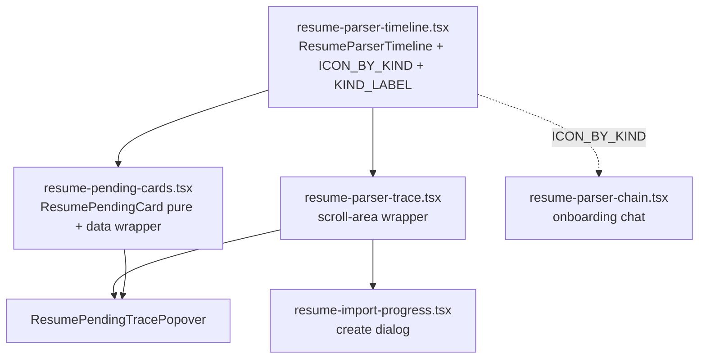

# 2026-06-23 15:43 — Resume parser streaming/live UI redesign

## Goal

Massively improve how the **live resume-parsing stream** renders on the dashboard and in the import flow.
The user's screenshot showed important info but it "looked off and weird": cramped log-style rows, an
oversized floating popover (480px) that overlapped the resume grid, the same step detail printed twice,
a stray `5%`, inconsistent iconography, and the percentage shown in two places.

**This work is complete in the working tree.** Nothing committed. No external prerequisites.

## What shipped

One shared visual language — a connected vertical **timeline/stepper** — now drives every parser surface.

### New file
- `apps/web/src/components/domains/resumes/resume-parser-timeline.tsx`
  - `ResumeParserTimeline` — pure/presentational. Props: `events`, `density` (`"compact" | "comfortable"`),
    `className`, `emptyLabel`. Renders an `<ol aria-live="polite">`; each event is a `TimelineRow` (extracted
    component) on a single rail.
  - State discriminant `TimelineState` (`complete | failed | pending | running`) via `STATE_BY_STATUS`
    (`canceled`→`failed`). Node tint/title color come from `Record` lookups `NODE_CLASS` / `TITLE_CLASS`
    (no nested ternaries, low cognitive complexity — both were lint-enforced).
  - Visual rules: completed nodes = `success` tint + kind glyph and **muted** title (recede); active = `info`
    tint + kind glyph + `animate-ping` ring (`motion-reduce:hidden`) + **shimmer** title (focus); failed =
    destructive `XIcon` + reason. Detail line is deduped against the title (kills the "detail twice" bug).
    Subtle `animate-in fade-in-0 duration-300` so streamed rows don't pop.
  - Exports the shared **`ICON_BY_KIND`** (rich Lucide map: briefcase/grad-cap/award/…) and **`KIND_LABEL`**
    (Spanish title fallbacks).

### Modified
- `resume-pending-cards.tsx` — split into a pure `ResumePendingCard` (exported, takes a
  `ResumePendingCardModel` + a `detail` node for the popover) and the realtime data wrapper
  `ResumePendingCards`. New layout: header `[Procesando] + title`, slim progress with **one** inline `%`,
  compact timeline of the recent trace, and a single **full-width "Ver detalle"** trigger. Removed the
  redundant footer phase-label and the duplicate `%`. Popover narrowed `w-120 → w-90` (480→360px). Trigger now
  uses the Base UI `render` prop (`<PopoverTrigger render={<Button…/>} />`) — fixes a latent nested-`<button>`.
  `ResumePendingTracePopover` (own `useRealtimeRun`) retained; renders `ResumeParserTrace`.
  `ACTIVE_STATUSES` converted `Set` → `Record<string, true>` (repo rule).
- `resume-parser-trace.tsx` — now a thin scroll-area wrapper around `ResumeParserTimeline` (kept `h-72`,
  `autoScroll` sentinel, props). Deleted the heavy `Task`/`Tool` collapsibles that duplicated the detail line.
- `resume-import-progress.tsx` (create dialog) — inherits the new trace; `FAILURE_STATUSES` `Set` → `Record`.
  Header/progress structure unchanged.
- `resume-parser-chain.tsx` (onboarding chat) — deleted its local copy of `ICON_BY_KIND`; imports the shared
  one. Structure otherwise unchanged (still uses the `ChainOfThought` ai-element, which fits the chat).

## Architecture

Surfaces that mount these (consumers unchanged except prop-shape):
- `routes/_protected/dash/resumes/index.tsx` → `<ResumePendingCards variant="grid">` (the screenshot).
- `components/domains/setup.analysis/resume-analysis.tsx` → `<ResumePendingCards variant="stack">` (sidebar).
- `components/domains/resumes/resume-create-dialog.tsx` → `<ResumeImportProgress>`.
- `components/domains/setup.chat/onboarding-chat.tsx` → `<ResumeParserChainOfThought>`.

## Data contract (reference, not re-pasted)

- Event shape: `ResumeParserEvent` in `packages/jobs/src/agents/resume-parser.handler.ts` (~L73-83):
  `{ at?, detail?, kind, mock?, progress?, reason?, status, title?, toolName? }`. `status` is schema-validated
  (`running | complete | failed | canceled`), so `STATE_BY_STATUS[status]` is always defined.
- Metadata writes: `packages/jobs/src/trigger/tasks/resume-parser.ts` `emitTrace` (~L243-269). `recentTrace`
  is a rolling window (`RECENT_TRACE_LIMIT`) of the last events incl. the running one → the card's compact
  timeline naturally shows the active step shimmering at the bottom. `currentLabel` mirrors the latest event's
  detail (this is **why** the card no longer prints a separate current-step line — it would duplicate the
  timeline's last row).
- Web mapping: `apps/web/src/components/domains/resumes/lib/map-parser-phase.ts` (`mapParserPhase`,
  `mergeResumeParserEvents`, `readResumeParserRecentTrace`) — **unchanged**. The card model dropped `phaseLabel`;
  it still uses `phase.displayName`, `phase.progress`, and the recent trace.

## Verification

- **Visual:** a temporary route `routes/dev-parser-preview.tsx` rendered the pure components against mock
  events (grid card, stack card, full timeline, popover opened from the real trigger, failed state). Screenshots
  on the live dev server confirmed: connected rail, distinct kind glyphs, completed-recede/active-shimmer
  hierarchy, red ✕ + reason on failure, working popover. **Harness removed**; route tree regenerated, no stale
  refs (`grep dev-parser-preview` → none).
- **Types:** `pnpm -F web exec tsc --noEmit` → **zero** errors in the changed files. Pre-existing, unrelated
  errors remain in untouched files (`shimmer.tsx` motion/React-types, `letters/*`, `otp-field.tsx`,
  `transactional/*`) — same baseline noted in the 00:08 handoff.
- **Lint:** `pnpm dlx ultracite check` clean on all 5 files (no `biome-ignore`). Resolved nested-ternary +
  cognitive-complexity by extracting `TimelineRow` and using `Record` lookups.
- **Runtime:** no console errors / no Vite error overlay on the preview.

## Not exercised / caveats

- **Live Trigger.dev streaming was not driven** (needs a real PDF upload + run). Verified via the pure-component
  harness with realistic mock events instead. The realtime wrappers (`useRealtimeRunsWithTag`,
  `useRealtimeRun`) are behavior-unchanged; only the mapped model shape changed (dropped `phaseLabel`).
- Two dev servers were live during the session: a pre-existing one on **3001** (used for screenshots) and the
  one this session launched on **3002** (killed by a 900s timeout). If verifying again, start fresh with
  `pnpm dev:web` and confirm the port from its output.
- Shared primitives left untouched on purpose: `progress.tsx` still uses `transition-all` (Emil would flag it),
  and `shimmer.tsx` has the pre-existing motion-types tsc error. Out of scope.

## Possible follow-ups

- Drive one real parse end-to-end and eyeball the live shimmer/ping cadence and the recent-trace window slide.
- Consider unifying the onboarding `ResumeParserChainOfThought` onto `ResumeParserTimeline` too (currently only
  the icon map is shared) if a single look across chat + dashboard is desired.
- The create-dialog copy refinements from `2026-06-23-0008-resume-linkedin-job-context-handoff.md` (Phase 7)
  are independent and already done there; this work didn't touch dialog copy.

## Suggested skills

- `impeccable` (product register) and `emil-design-eng` — for any further polish/motion passes on these surfaces.
- `agent-browser` / `verification` — to drive a real upload and watch the live stream.
- `react-doctor` / `vercel-react-best-practices` — if revisiting the realtime data wrappers for perf.
