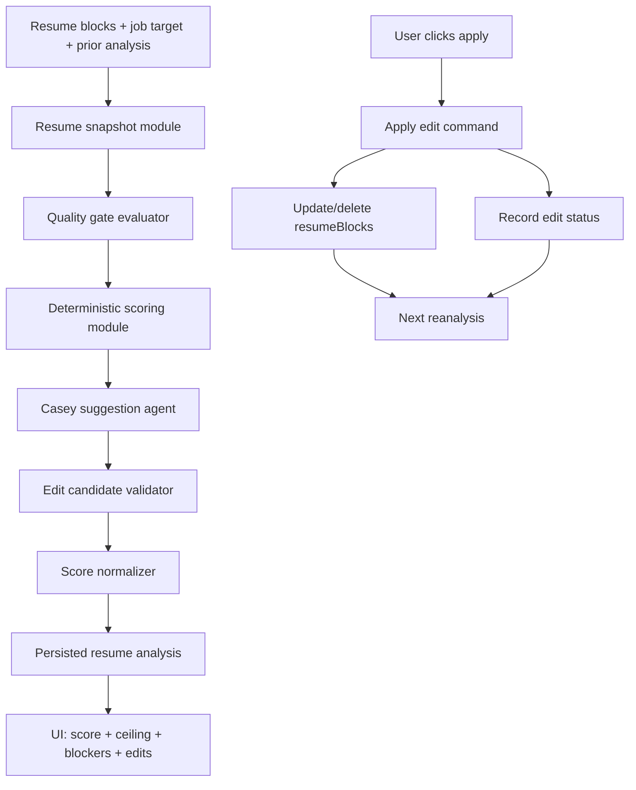

# 2026-06-24 — Casey resume scoring and tool-based architecture plan

## Goal

Fix Casey's detailed resume scoring loop so users understand why applying every suggested fix may still not produce
`100`, and make the scoring architecture deterministic enough that model output cannot silently violate the score
contract.

Core product distinction:

- **Current score**: actual quality of the current resume.
- **One-click gains**: improvements Casey can safely apply from existing resume facts.
- **Score ceiling**: highest score reachable without user-supplied facts, missing structure, or manually added content.
- **Blockers to 100**: quality gates that still cap one or more categories.

## Decisions locked

- **No automated tests.** Do not add `*.test.*`, `*.spec.*`, fixtures, or test harness changes for this work.
- User will validate manually. Implementation should make manual validation easy through UI state, logs, and persisted
  metadata.
- Do not promise `100` after applying all edits. Promise a clear explanation of remaining blockers.
- Keep Casey in Spanish for user-facing suggestions (`title`, `description`, gate copy). Enum values remain English.
- Keep deterministic score math outside the model. The model may propose improvements, but server code owns scoring
  invariants.
- `100` means rubric-perfect for the current target **job** context.
- Avoid AI hallucination at all costs. Casey must never invent metrics, achievements, dates, certifications, employers,
  scope, tools, or outcomes that are not present in the resume or supplied by the user/job target.
- No backward-compatibility requirement for old analyses. Prefer a clean cutover and schema/data reset path over shims.

## Current diagnosis

### Main failure mode

Applying every visible Casey edit does not guarantee `100` because the current interface blends three different
concepts into one number:

1. model-estimated resume quality,
2. suggested edit deltas,
3. hidden hard caps from the rubric.

The prompt says edits have deltas and categories, but several caps can still block `100`:

- too few experience entries,
- missing bullets/descriptions,
- missing dates,
- duplicate entries,
- meta-commentary / placeholders,
- no measurable achievements,
- missing contact section,
- resume too short.

If Casey proposes five one-click edits, those edits may only fix part of the problem. User-supplied facts may still be
required for true `100`.

### Code-level causes

- `packages/jobs/src/agents/k02-detailed-analysis.handler.ts`
  - Giant prompt owns scoring rules, delta budget, hard caps, applyability, prior-analysis semantics, and output style.
  - `resumeAnalysisSchema` only enforces shape; it does not enforce weighted overall, caps, applied floors, or budgets.
- `packages/jobs/src/trigger/tasks/k02-detailed-analysis.ts`
  - `clampEditDeltas` only drops newly emitted edits whose deltas exceed category budget.
  - No deterministic recompute of `scoreOverall`.
  - No deterministic enforcement of prior applied-edit floors.
- `apps/web/src/routes/_protected/dash/resumes/$resumeId.tsx`
  - Applying rewrite edits mutates form state, queues autosave, flushes async, then returns `true` immediately.
- `apps/web/src/components/domains/resume-editor/resume-analysis-section.tsx`
  - If `onApplyEdit` returns `true`, it marks the edit applied through `resumeAnalyses.setEditApplied`.
- `packages/api/src/routers/resume-analyses.ts`
  - Applied/dismissed status mutates metadata only.
  - It does not validate edit index bounds, mutual exclusion, or whether resume block mutation persisted.

Result: reanalysis can see `appliedEditIndices` without guaranteed persisted resume content, or can accept model scores
that do not match intended math.

## Target architecture

Casey should stop being one giant prompt that does everything. Make Casey a small orchestrator with deterministic
modules and narrow model responsibilities.



### Module split

#### 1. Resume snapshot module

New or extracted module:

`packages/jobs/src/lib/resume-analysis/resume-snapshot.ts`

Interface:

- input: active `resumeBlocks`, optional job target, optional prior analysis context.
- output:
  - block tree,
  - flattened searchable block text,
  - word count excluding contact,
  - experience entry count,
  - bullets per entry,
  - missing dates,
  - duplicate entries,
  - detected placeholders/meta-commentary,
  - measurable achievement signals,
  - contact presence.

Purpose: Casey should not rediscover basic facts from raw JSON every run.

#### 2. Quality gate evaluator

New module:

`packages/schemas/src/ai/resume-quality-gates.ts`

Interface:

```ts
type ResumeQualityGate = {
  id: string;
  category: "impact" | "keywords" | "clarity" | "formatting" | "length";
  cap: number;
  severity: "blocking" | "warning";
  title: string;
  description: string;
  resolvableBy: "one_click" | "user_input" | "manual_structure";
};
```

Responsibilities:

- apply rubric caps deterministically where possible,
- identify blockers that explain why `100` is not reachable,
- expose gates to Casey and UI.

Initial gates should cover existing prompt caps. Keep gates conservative. If a gate cannot be detected reliably by code,
leave it for Casey to mention as a suggestion, not as a deterministic cap.

#### 3. Deterministic scoring module

New module:

`packages/schemas/src/ai/resume-scoring.ts`

Responsibilities:

- category weights:
  - impact `30%`,
  - keywords `25%`,
  - clarity `20%`,
  - formatting `15%`,
  - length `10%`.
- `calculateScoreOverall(scoreBreakdown)`.
- clamp sub-scores `0..100`.
- apply quality-gate caps.
- calculate one-click score ceiling from current score + valid one-click deltas + gates.
- enforce prior applied edit floors:
  - if prior `impact=80` and applied impact deltas are `10 + 5`, next impact must be at least `95`, capped at `100`.
- normalize output before persistence.

This module is the deep scoring interface. The model no longer owns score math.

#### 4. Casey suggestion agent

Update:

`packages/jobs/src/agents/k02-detailed-analysis.handler.ts`

Reduce system prompt scope. Casey should only:

- read a prepared resume snapshot,
- read quality gates and score budgets,
- propose concrete edit candidates,
- explain unresolved blockers in Spanish,
- avoid repeats based on prior edit status.

Casey should not be trusted to:

- calculate final weighted score,
- enforce applied delta floors,
- validate exact substring applyability,
- decide whether a persisted edit really happened.

#### 5. Edit candidate validator

New module:

`packages/jobs/src/lib/resume-analysis/edit-candidate-validator.ts`

Responsibilities:

- verify `targetBlockId` exists,
- verify `before` exists exactly in allowed content field,
- reject placeholder `after` values (`X%`, `[metric]`, `<your metric>`, etc.),
- reject `delete` on contact block,
- reject `rewrite` without `before` + `after`,
- assign stable `editId`,
- trim candidate list to budget.

The validator should produce two outputs:

- `validEdits`: safe one-click edits,
- `informationalEdits`: user-actionable but not one-click applyable.

#### 6. Score normalizer

New module:

`packages/jobs/src/lib/resume-analysis/normalize-resume-analysis.ts`

Runs after `await result.output` and before persistence.

Responsibilities:

- call deterministic scoring module,
- recompute `scoreOverall`,
- clamp category scores,
- enforce prior applied floors,
- calculate `scoreCeiling`,
- attach `qualityGates`,
- drop or downgrade invalid edits,
- log normalization changes.

This replaces `clampEditDeltas` as the main persistence gate. `clampEditDeltas` can be deleted or moved inside the
normalizer.

#### 7. Apply edit command

New API command module:

`packages/api/src/lib/resume-analysis/apply-resume-analysis-edit.ts`

Router entry:

`packages/api/src/routers/resume-analyses.ts`

Interface:

```ts
applyEdit({ analysisId, editId })
```

Responsibilities:

- load analysis owned by user,
- find edit by stable `editId`,
- validate current target block still matches,
- update/delete `resumeBlocks`,
- record edit applied status,
- return updated analysis status.

Do content mutation and status mutation in one awaited server operation. UI should no longer do the rewrite/delete itself
for Casey edits.

#### 8. Edit ledger

Current persistence:

- `appliedEditIndices: number[]`,
- `dismissedEditIndices: number[]`.

Problems:

- index-based,
- no bounds validation,
- overlap possible,
- no operation result,
- meaning changes if edits reorder.

Target:

- stable `editId` on each edit,
- status record or event:
  - `pending`,
  - `applied`,
  - `dismissed`,
  - `failed`.
- operation metadata:
  - `appliedAt`,
  - `dismissedAt`,
  - `error`,
  - target block id,
  - action.

This can be a new table later. First step can store a JSON ledger on `resume_analyses` if migration cost must stay low.

## Tool-based Casey direction

Use tools/modules to shrink Casey's prompt. Not every tool must be model-visible. Prefer deterministic pre/post modules
when code can answer reliably; give model-visible tools only when Casey needs controlled lookup or validation during
reasoning.

### Recommended model-visible tools

If migrating from `streamText` prompt-only to a tool loop, expose read-only/validation tools first:

- `getResumeSnapshot`
  - returns prepared snapshot, not raw DB rows.
- `getTargetJobContext`
  - returns normalized job target with skills/requirements/keywords.
- `evaluateQualityGates`
  - returns deterministic gates and caps.
- `getScoreBudget`
  - returns remaining points available per category.
- `validateEditCandidate`
  - checks exact block match and applyability before Casey finalizes an edit.

Do **not** expose DB write tools to Casey for scoring. Applying edits remains user-triggered through the server command.

### Practical implementation path

Start without a full `ToolLoopAgent` migration if that is faster:

1. build snapshot/gates/budget in code,
2. pass those compact objects to Casey,
3. have Casey output edit candidates,
4. validate + normalize in code,
5. persist only normalized result.

Then, if prompt size or reliability still hurts, move Casey to a tool loop where it can call `validateEditCandidate`
before final output. This avoids a large rewrite while still splitting responsibility away from one giant prompt.

## Schema and database updates

Clean cutover. Do not preserve old analysis shape as a product requirement.

### Schema package

Update `packages/schemas/src/ai/resume-analysis.ts` so new detailed analyses require:

```ts
rubricVersion: string;
scoreOverall: number;
scoreBreakdown: Record<EditCategory, number>;
qualityGates: ResumeQualityGate[];
scoreCeiling: {
  scoreOverall: number;
  scoreBreakdown: Record<EditCategory, number>;
  blockers: string[];
};
edits: Array<ResumeEdit & {
  editId: string;
  applyability: "one_click" | "user_input" | "informational";
  evidence: ResumeEditEvidence[];
}>;
userInputRequests: ResumeUserInputRequest[];
```

### DB schema

Update `packages/db/src/schema/resume-analyses.ts` instead of only changing Zod schemas.

Required persistence changes:

- add `rubricVersion` to `resume_analyses`;
- add `scoreCeiling` JSON column;
- add `qualityGates` JSON column;
- replace `appliedEditIndices` / `dismissedEditIndices` with edit-status data keyed by `editId`;
- either add `editStatuses` JSON column on `resume_analyses` or create a dedicated `resume_analysis_edit_events` table.

Recommended DB shape:

- keep normalized analysis result in `resume_analyses.object`;
- add top-level queryable columns only for data the app filters/sorts by (`rubricVersion`, `scoreOverall`, status);
- use `resume_analysis_edit_events` if we need auditability, partial batch results, or debugging;
- use JSON `editStatuses` only if we want the smallest migration.

Since backward compatibility is not required, old rows can be reset, deleted in development, or treated as invalid for the
new detailed-analysis UI.

## UI changes

Files:

- `apps/web/src/components/domains/resume-editor/resume-analysis-panel.tsx`
- `apps/web/src/components/domains/resume-editor/resume-analysis-section.tsx`
- `apps/web/src/routes/_protected/dash/resumes/$resumeId.tsx`

Changes:

- Show current score as today.
- Add “Techo con mejoras disponibles” / one-click ceiling.
- Add “Bloqueos para llegar a 100”.
- Separate one-click edits from informational/user-input edits.
- After apply, call server `applyEdit` command instead of local rewrite/delete.
- Re-analysis button copy should set expectation:
  - current: `Re-analizar`,
  - better: `Recalcular puntaje` or `Revisar CV actualizado`.

## Open discussion topics before implementation

These are the parts most likely to be underspecified or accidentally wrong if implementation starts too early.

### 1. What does `100` mean?

Decision: `100` means rubric-perfect for the current target **job** context.

`100` does **not** mean:

- universally excellent for every role,
- all known issues fixed,
- all one-click edits applied,
- or Casey found five suggestions.

Applying every one-click edit should only promise the **one-click ceiling**, not `100`.

### 2. Generic score vs job-specific score

This is about what Casey scores against.

If a LinkedIn job target exists, the resume should be scored against that job's requirements. The `keywords` score is not
generic anymore; it is “does this resume match this job?” A resume can be strong generally and still score lower for a
specific job if it misses required skills, tools, seniority, or domain language.

Decision needed:

- Target job context is required for a true `100`.
- If no target job exists, the analysis should be labeled as baseline/untargeted and should not imply job-perfect `100`.
- UI should prefer job-specific language when a target exists: `Puntaje para este puesto`.

### 3. Rubric and DB schema versioning

The rubric must be versioned and persisted. This requires database schema changes, not only Zod schema changes.

Persist with every detailed analysis:

- `rubricVersion`,
- `scoreCeiling`,
- `qualityGates`,
- edit statuses keyed by `editId`,
- optional normalization/debug metadata if useful for manual QA.

No backward compatibility requirement. If old analyses do not match the new shape, delete, reset, or invalidate them.

### 4. Safe applied-delta floors

Applied edit deltas should create score floors only when safe.

Unsafe rule:

- prior `impact=80`,
- applied edit says `+10`,
- next analysis forces `impact>=90` forever.

That can lie if the user later deletes the improved content.

Safe rule:

- an applied edit may raise the category floor only if its expected content/evidence is still present;
- if the expected content is missing, mark the edit `stale` or ignore its delta for floor math;
- if the validator cannot prove the improvement still exists, do not use the delta as a floor.

### 5. Batch “apply all” semantics

This means defining what happens when the user clicks “apply all fixes” instead of applying one edit at a time.

The hard part: edits may touch the same block or depend on each other.

Example:

1. Edit A rewrites a bullet.
2. Edit B rewrites the same bullet again.
3. If the server applies A first, B's original `before` text may no longer exist.

So `applyAllEdits({ analysisId })` needs a rule:

- **atomic**: all edits apply or none apply;
- **best-effort**: apply what can be applied, report failures;
- **ordered batch**: apply one edit, re-check the next edit against updated content, continue.

Recommended: ordered server-side batch with per-edit results.

UI should show:

- `applied`,
- `skipped`,
- `failed`,
- failure reason.

This avoids pretending “apply all” is one simple operation when it is really a sequence of content patches.

### 6. Structured edits for better agent and user handling

The current `before` / `after` text patch shape is too weak for structured resumes.

Better structure:

```ts
type ResumeEditOperation =
  | {
      kind: "rewrite_field";
      blockId: number;
      fieldPath: string;
      before: string;
      after: string;
      evidence: ResumeEditEvidence[];
    }
  | {
      kind: "insert_entry";
      blockId: number;
      entryType: "experience" | "education" | "project" | "skill";
      value: unknown;
      evidence: ResumeEditEvidence[];
    }
  | {
      kind: "delete_entry";
      blockId: number;
      entryId: string;
      reason: string;
      evidence: ResumeEditEvidence[];
    }
  | {
      kind: "ask_user";
      question: string;
      targetCategory: EditCategory;
      requiredEvidence: string;
    };
```

What this improves:

- Casey targets exact fields instead of fuzzy text;
- API can validate operations against block schemas;
- UI can render better controls per operation type;
- user-input requests become first-class instead of fake edits;
- server can apply safe edits without guessing where text belongs;
- anti-hallucination evidence becomes required data, not prompt-only instruction.

Recommended: support structured operations for known block types first. Keep text rewrite only as fallback for long
narrative fields.

### 7. User-input requests are required

Some high-impact improvements require facts Casey cannot know:

- exact metrics,
- dates,
- certification IDs,
- team size,
- revenue/cost/user impact,
- tools actually used,
- project outcomes.

These must not be emitted as one-click edits.

Model them separately:

```ts
type ResumeUserInputRequest = {
  id: string;
  category: EditCategory;
  question: string;
  whyItMatters: string;
  targetBlockId?: number;
  unlocksPotentialPoints: number;
};
```

UI can then ask the user for facts and only generate/score improvements after the user supplies the missing evidence.

### 8. Anti-hallucination policy

Hard rule: NEVER hallucinate.

Casey must never invent:

- numbers,
- dates,
- tools,
- employers,
- certifications,
- education,
- languages,
- awards,
- company names,
- impact metrics,
- responsibilities,
- outcomes.

Allowed:

- improve wording using facts already present;
- reorganize existing facts;
- ask the user for missing facts;
- mark score blockers caused by missing evidence.

Not allowed:

- converting “helped sales team” into “increased revenue by 35%”;
- adding “React, AWS, Kubernetes” because the target job asks for them;
- creating certifications or degrees;
- inventing dates to satisfy formatting.

Every one-click edit must carry evidence:

```ts
type ResumeEditEvidence = {
  source: "resume" | "target_job" | "user_answer";
  blockId?: number;
  fieldPath?: string;
  quote: string;
};
```

The validator rejects any edit whose new factual claim is not backed by evidence.

### 9. Tool loop vs pre/post modules

The plan still starts with deterministic pre/post modules:

1. code builds resume snapshot, gates, and budget;
2. Casey proposes structured edit operations;
3. code validates evidence and applyability;
4. code normalizes score;
5. only validated output persists.

Model-visible tools come later only if needed.

Candidate model-visible tools:

- `validateEditCandidate`,
- `lookupResumeEvidence`,
- `getScoreBudget`,
- `evaluateQualityGates`.

Do not expose write tools to Casey. User-triggered API commands own writes.

### 10. Observability without automated tests

Because this work intentionally avoids automated tests, manual validation needs runtime evidence.

Log or persist enough metadata to inspect:

- score normalization diffs,
- gate caps applied,
- rejected/downgraded edit candidates,
- missing evidence rejections,
- apply command failure reasons,
- apply-all partial results,
- apply -> reanalyze score movement.

This supports manual QA without adding test files.

### 11. Clean cutover, no old-analysis compatibility

Backward compatibility is not a requirement.

Decision:

- new analysis schema can be required immediately;
- old rows do not need UI fallback;
- old index arrays can be removed instead of migrated;
- if local/dev data breaks, reset analyses and regenerate;
- production cutover can delete or invalidate old analyses if needed.

This keeps the module deeper and avoids carrying shims around a bad interface.

## Implementation phases

### Phase 1 — Schema and DB cutover

Files:

- `packages/db/src/schema/resume-analyses.ts`
- new migration
- `packages/schemas/src/ai/resume-analysis.ts`
- `packages/schemas/src/ai/resume-quality-gates.ts`
- `packages/schemas/src/ai/resume-scoring.ts`

Work:

- add required `rubricVersion`;
- add required `scoreCeiling`;
- add required `qualityGates`;
- add structured edit operation types;
- add required `editId`;
- add required edit evidence;
- add `userInputRequests`;
- replace index-based status with `editId`-keyed status/events;
- do not preserve old analysis compatibility.

Manual validation:

- new analysis rows have rubric/version/gates/ceiling;
- old rows are not treated as valid new analysis data;
- UI/API do not depend on `appliedEditIndices` / `dismissedEditIndices`.

### Phase 2 — Scoring constants and safe normalizer

Files:

- `packages/schemas/src/ai/resume-scoring.ts`
- `packages/jobs/src/lib/resume-analysis/normalize-resume-analysis.ts`
- `packages/jobs/src/trigger/tasks/k02-detailed-analysis.ts`

Work:

- add weights and `calculateScoreOverall`;
- define `100` as rubric-perfect for current target job context;
- replace persisted `scoreOverall` with deterministic recompute;
- clamp scores to `0..100`;
- enforce applied-edit category floors only when the expected evidence/content still exists;
- mark missing applied evidence as `stale`;
- move `clampEditDeltas` into normalizer or delete it after replacement.

Manual validation:

- run detailed analysis on a resume with a target job;
- confirm overall equals weighted breakdown;
- apply an edit, reanalyze, confirm safe score movement;
- delete the improved content, reanalyze, confirm the previous applied delta no longer inflates the score.

### Phase 3 — Resume snapshot, gates, and ceiling

Files:

- `packages/jobs/src/lib/resume-analysis/resume-snapshot.ts`
- `packages/schemas/src/ai/resume-quality-gates.ts`
- `packages/jobs/src/lib/resume-analysis/normalize-resume-analysis.ts`

Work:

- derive structured resume facts once;
- detect deterministic blockers;
- compute `scoreCeiling`;
- distinguish target-job score from baseline/untargeted score;
- ensure no target job means no job-perfect `100` claim.

Manual validation:

- use a resume with missing dates or too few bullets;
- apply all one-click edits;
- reanalyze;
- confirm score below `100` includes visible blocker reason and one-click ceiling.

### Phase 4 — Structured Casey output and anti-hallucination validator

Files:

- `packages/jobs/src/agents/k02-detailed-analysis.handler.ts`
- `packages/jobs/src/lib/resume-analysis/edit-candidate-validator.ts`
- `packages/jobs/src/trigger/tasks/k02-detailed-analysis.ts`

Work:

- shrink prompt to candidate generation;
- output structured edit operations instead of only free-text patches;
- require evidence for every factual claim;
- reject edits that introduce unsupported facts;
- produce `userInputRequests` when evidence is missing;
- optionally expose `validateEditCandidate` as a model-visible tool if prompt-only candidates remain unreliable.

Manual validation:

- confirm Casey never invents metrics, tools, dates, employers, certifications, or outcomes;
- confirm missing metrics become user questions;
- confirm unsupported factual edits are rejected or downgraded before persistence.

### Phase 5 — Server-side apply command, apply-all, and edit events

Files:

- `packages/api/src/lib/resume-analysis/apply-resume-analysis-edit.ts`
- `packages/api/src/routers/resume-analyses.ts`
- `packages/db/src/schema/resume-analyses.ts` or new edit-event table
- `apps/web/src/components/domains/resume-editor/resume-analysis-section.tsx`
- `apps/web/src/routes/_protected/dash/resumes/$resumeId.tsx`

Work:

- add `applyEdit({ analysisId, editId })`;
- add `applyAllEdits({ analysisId })` as ordered server-side batch if the UI keeps “apply all”;
- apply one edit, re-check the next edit against updated content, continue;
- record per-edit result: `applied`, `skipped`, `failed`, `stale`;
- mark applied only after content mutation succeeds;
- remove index-array status logic.

Manual validation:

- apply rewrite edit and refresh page; block content remains changed and edit remains applied;
- force stale target content; apply command fails/stales and does not mark applied;
- apply all on overlapping edits; UI shows per-edit results instead of lying.

### Phase 6 — UI expectation, blockers, and user-input flow

Files:

- `apps/web/src/components/domains/resume-editor/resume-analysis-panel.tsx`
- `apps/web/src/components/domains/resume-editor/resume-analysis-section.tsx`

Work:

- show `Puntaje para este puesto` when target job exists;
- show one-click ceiling;
- show blockers to `100`;
- split one-click edits from user-input requests;
- render user questions as a path to unlock points;
- avoid implying one-click edits guarantee `100`.

Manual validation:

- user can tell why score remains below `100`;
- user can distinguish safe edits from questions requiring their facts;
- no UI copy implies Casey invented or verified unsupported facts.

## Recommended order

1. Phase 1: schema and DB cutover.
2. Phase 2: normalize score math safely.
3. Phase 3: expose gates and ceiling.
4. Phase 4: structured Casey output + anti-hallucination validator.
5. Phase 5: server-side apply/apply-all.
6. Phase 6: UI expectation and user-input flow.

Reason: the schema must represent the new contract first. Then score correctness, gates, and anti-hallucination rules can
be enforced before user actions are rewired.

## Non-goals

- Do not force every resume to reach `100`.
- Do not fabricate metrics to make one-click edits stronger.
- Do not auto-apply edits without user action.
- Do not add automated tests in this implementation pass.
- Do not preserve old analysis compatibility.
- Do not migrate all AI flows at once; start with detailed resume analysis.

## Acceptance criteria

- `100` means rubric-perfect for the current target job context.
- Applying all one-click edits never creates an impossible expectation of `100`.
- If score stays below `100`, analysis contains visible blockers or score ceiling explaining why.
- Persisted `scoreOverall` always matches weighted `scoreBreakdown` after normalization.
- Reanalysis honors applied edit deltas only when supporting evidence/content still exists.
- Casey never persists a one-click edit with unsupported factual claims.
- Missing facts become `userInputRequests`, not hallucinated improvements.
- Invalid one-click edits are rejected, stale, or downgraded before persistence.
- Casey prompt is shorter and focused on structured candidate generation, not all scoring math.
- No new automated test files are added.
