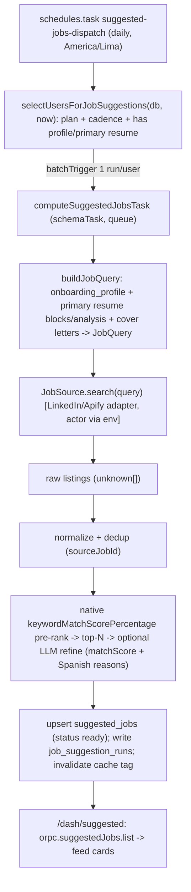

# Suggested Jobs ("Targets") — Feature Plan

Route: `apps/web/src/routes/_protected/dash/suggested.tsx` (today a `ComingSoon` placeholder behind `FeatureGate requiresPaid`).

Goal: surface a per-user feed of recommended job openings, sourced initially from LinkedIn (via Apify), computed on a Trigger.dev cron whose cadence depends on plan (free = monthly, pro/max = daily), grounded in the user's `onboarding_profile` + primary resume + cover letters. Architecture must be **source-agnostic** so we can add Indeed, Bumeran, Computrabajo, company boards, etc. later without touching the task/UI.

PRD alignment: §6/§Direction already reserve **"Targets (Recommended vacancies)"** as a surface that "need[s] defined IO contracts and quotas" (`prd.md:155`, `prd.md:263`) and calls for a "tighter loop between Targets and CV/cover-letter tailoring" (`prd.md:160`). This plan defines those contracts.

---

## 0. Open questions / decisions needed before coding the fetch

1. **✅ RESOLVED — Apify actor.** Using `cheap_scraper/linkedin-job-scraper` (pay-per-result, keyword-search mode). Behind env `APIFY_LINKEDIN_JOB_SEARCH_ACTOR` (default `cheap_scraper~linkedin-job-scraper`), invoked via `run-sync-get-dataset-items` like `lib/linkedin/fetch-job.ts`. Full IO contract locked in §Phase 2. Cost floor: `maxItems` minimum **150 results/run** (~$0.05–$0.11/run at $0.35–$0.70 per 1,000); always `saveOnlyUniqueItems: true`, `enrichCompanyData: false`.
2. **Free tier: get suggestions monthly, or gate entirely?** Your instruction says free = once per month. The current page uses `FeatureGate requiresPaid` and `prd.md:156` calls Targets "paid". These conflict. This plan follows **your instruction** (free monthly, paid daily) and swaps `requiresPaid` for data-availability gating. Confirm if free should instead see a locked upsell.
3. **Match scoring — decided (default).** The actor scores each listing against `resumeKeywords` natively — `keywordMatchScorePercentage` (0–100) + `matchedKeywords`/`unmatchedKeywords` — at no extra token cost. v1 pre-ranks by that native score, cuts to the plan's `suggested_jobs_per_run`, then runs **one bounded LLM pass over only those top-N** to refine `matchScore` and write Spanish `reasons` (§Decision C). `SUGGESTED_JOBS_SKIP_LLM=1` ships pure-native (zero tokens). Confirm whether LLM refine is on for v1.
4. **Per-run cap & retention — decided.** Hard ceiling **50 surfaced results per run** (more is noise). We over-fetch the actor's 150-result billing floor, score, then keep only the top ≤ plan cap: `suggested_jobs_per_run` = free **20** / pro **40** / max **50**. The feed is the latest run's kept set; rows are superseded on the next run (`onConflictDoUpdate`) and expired after 45 days.

---

## 1. Architecture overview

Runtime split (existing convention): tasks use `getTriggerDb()` from `@stackk-career/db/http` (HTTP libSQL, no native binding — see `packages/db/src/http.ts`), API uses `context.db`. Cache via `$withCache({ tag })` + `db.$cache.invalidate({ tags })`.

---

## 2. Key design decisions

**A. Source-agnostic provider layer** (mirrors the existing single-job adapter boundary at `packages/jobs/src/lib/linkedin/fetch-job.ts`, which deliberately keeps Apify behind one file so "swapping to another provider only means rewriting this file").

- New dir `packages/jobs/src/lib/job-sources/`:
  - `types.ts` — `interface JobSource { id: JobSourceId; search(query: JobQuery, signal?): Promise<SourcedListing[]> }`. Each adapter owns the raw→canonical mapping so everything downstream is 100% source-neutral; `SourcedListing = { listing: JobListing; nativeScore: number|null; dynamicFilterMatch: boolean }` carries the provider's free native fit score next to the normalized listing. `RawJobListing = Record<string, unknown>` is the loose per-actor input to the mapper.
  - `linkedin-apify.ts` — first impl. Actor id from `APIFY_LINKEDIN_JOB_SEARCH_ACTOR` (default `cheap_scraper~linkedin-job-scraper`), reads `APIFY_TOKEN`, calls `run-sync-get-dataset-items`. Pure `buildActorInput` (JobQuery→actor input) + `mapLinkedinItem` (raw→SourcedListing; skips rows missing id/url) are unit-tested against `fixtures.ts` (no live spend). Config vs. transient errors split into `JobSourceConfigError`/`JobSourceFetchError`; an empty result is valid (returns `[]`, never throws).
  - `registry.ts` — `getJobSource(id): JobSource`. Task iterates an ordered `enabledSources` list so adding a source is one registry line.
- `provider` column persisted per row (already the pattern in `resume_job_targets.provider`, `fetch-job.ts:9`).

**B. Two tables, not one** (mirror `resume_job_targets` + run-ledger discipline).

- `suggested_jobs` — the surfaced listings (one row per user × source-job). Dedup on `(userId, source, sourceJobId)`.
- `job_suggestion_runs` — per-user run ledger for **cadence enforcement**, idempotency, and observability (how many fetched/kept, error, duration). This is what the dispatcher reads to decide eligibility (`lastCompletedAt`), analogous to how `engagement-nudge` joins `transactional_emails` to avoid double-sends.

**C. Query build + scoring** — the actor does most of the ranking work.

- `buildJobQuery` (deterministic, no LLM): map `onboarding_profile` (`targetRole`, `industry`, `location`, `languages`, `experience`) + primary resume signal (title, top skills/keywords from latest `resume_analyses.object` or `resume_blocks`) into a `JobQuery` — `keyword[]`, `location`, `workType`, `experienceLevel`, `jobType`, `publishedAt` (window derived from cadence), plus `resumeKeywords[]` (the user's skills, feeding the actor's native match scoring). Cheap, testable, no spend.
- **Scoring is native-first.** Each listing arrives with `keywordMatchScorePercentage`. Drop `dynamicFilterMatch:false`, pre-rank by that score, cut to the plan's `suggested_jobs_per_run` (hard ceiling **50**).
- `rankSuggestedJobs` (optional, one LLM pass over only the top-N): `Output.array(rankedJobSchema)` refines `matchScore` for the role/seniority/location fit a purely lexical score misses and writes short Spanish `reasons`. Model + gateway tags mirror `linkedin-job-normalizer.handler.ts`. Toggle via `SUGGESTED_JOBS_SKIP_LLM`; when skipped, `matchScore = keywordMatchScorePercentage` and `reasons` derive from `matchedKeywords`.

**D. Cadence = single daily dispatcher + eligibility predicate** (not two crons). One `schedules.task` runs daily; `selectUsersForJobSuggestions` returns users due *today*:

- pro/max: due every day.
- free: due when `job_suggestion_runs.completedAt` (latest) is null or `>= 30 days` ago.
- All: require an `onboarding_profile` row **and** a primary resume (`resumes.isPrimary = true`) — no profile ⇒ nothing to search on.
- Fan out with `batchTrigger` + idempotency key `suggest:{userId}:{isoDate}` so a re-run same day is a no-op. This self-heals missed days and avoids drift between two schedules. Plan-cadence lives in one pure helper `jobSuggestionCadenceForPlan(planId): "daily" | "monthly"` in `@stackk-career/schemas/subscriptions`.

**E. Failure is non-fatal & isolated** (same posture as `linkedin-job-fetch`): a per-user run failing marks its `job_suggestion_runs` row `failed` via `onFailure` and never blocks other users; existing `ready` suggestions stay visible.

---

## 3. Phases

### Phase 1 — Contracts: schema, zod, entitlements
Files:
- `packages/db/src/schema/suggested-jobs.ts` (new): `suggestedJobs` + `jobSuggestionRuns` tables, relations, indexes. Register in `packages/db/src/schema/index.ts`.
  - `suggested_jobs`: `id` (`sjob_` prefix), `userId` FK cascade, `source` (default `"linkedin"`), `sourceJobId`, `url`, `title`, `company`, `location`, `employmentType`, `seniority`, `postedAt`, `matchScore` (int), `matchReasons` (json), `structured` (json — normalized listing), `status` enum `["ready","dismissed","expired"]`, `runId` FK, timestamps. Indexes: `uniqueIndex(userId, source, sourceJobId)`, `index(userId)`, `index(status)`, `index(userId, matchScore)`.
  - `job_suggestion_runs`: `id` (`sjrun_`), `userId` FK, `status` enum `["pending","running","ready","failed"]`, `source`, `fetchedCount`, `keptCount`, `error`, `startedAt`, `completedAt`, timestamps. Index `(userId, completedAt)`.
- `packages/schemas/src/jobs/job-discovery.ts` (new): `jobQuerySchema`, `jobListingSchema` (normalized listing — lighter sibling of `jobPostingSchema`; reuse fields where possible), `rankedJobSchema`, `computeSuggestedJobsInputSchema` (`{ userId, runId, cadence }`), step enum for `metadata.set`.
- `packages/schemas/src/subscriptions/`: add limit key `suggested_jobs_per_run` to `limitKeyEnum` (`types.ts`) + `entitlementMapSchema`, values in `PLAN_CATALOG` (free **20** / pro **40** / max **50** — 50 is the hard per-run ceiling), label in `LIMIT_KEY_LABELS`. Add `jobSuggestionCadenceForPlan(planId)` + export from `subscriptions/index.ts`.
  - Note: `suggested_jobs_per_run` is per-run, not a cached per-cycle counter — it does NOT go in `cachedUsageLimitKeys` (same exclusion pattern as `cover_letter_versions`; see `types.ts:42`).
- `db:push` to apply schema (Turso). No data migration (new tables).

Acceptance: types compile across db/schemas; `pnpm --filter @stackk-career/db db:push` applies cleanly.

### Phase 2 — Source layer + LinkedIn/Apify adapter (`cheap_scraper/linkedin-job-scraper`)
Files: `packages/jobs/src/lib/job-sources/{types,linkedin-apify,registry}.ts`.
- `linkedin-apify.ts`: reads `APIFY_TOKEN` (see `fetch-job.ts`) + `APIFY_LINKEDIN_JOB_SEARCH_ACTOR` (default `cheap_scraper~linkedin-job-scraper`); missing token ⇒ `JobSourceConfigError` (non-retryable, like `fetch-job.ts:32`). POST the mapped input to `https://api.apify.com/v2/acts/{actor}/run-sync-get-dataset-items?token=…` (synchronous, same call shape as `fetch-job.ts`), map each item via `mapLinkedinItem`, and return `SourcedListing[]` (empty result ⇒ `[]`).
- **Input mapping** (`JobQuery` → actor input, keyword-search mode):
  - `keyword` ← `query.keywords`; `locations` ← `[query.location]` (omit when null)
  - `workType` ← `["remote"]`/`["on-site"]` from `query.remote` (omit when null); `experienceLevel` ← seniority (EN/ES) mapped to one of `internship|entry-level|associate|mid-senior|director` (omit when unrecognized)
  - `jobType` ← employmentType mapped to `full-time|part-time|contract|temporary|internship`
  - `publishedAt` ← `query.postedWithinDays` bucketed (≤1 ⇒ `"r86400"`, ≤7 ⇒ `"r604800"`, else `"r2592000"`); `buildQuery` sets `postedWithinDays` from cadence (daily ⇒ 7, monthly ⇒ 30)
  - `resumeKeywords` ← `query.resumeKeywords`; `maxItems` ← **150** (the actor's pay-per-result floor — we fetch 150 for selection quality, then surface only the top ≤ plan cap); `saveOnlyUniqueItems: true`; `enrichCompanyData: false`
- **Output mapping** (`mapLinkedinItem`: actor item → `SourcedListing`): `listing.sourceJobId`←`jobId`, `url`←`jobUrl` (‖ `applyUrl`), `title`←`jobTitle`, `company`←`companyName`, `location`←`location`, `employmentType`←`contractType`, `seniority`←`experienceLevel`, `postedAt`←`publishedAt` (ISO), `summary`← first ~400 chars of `jobDescription`, `skills`←`matchedKeywords`, `keywords`←`unmatchedKeywords`; `nativeScore`←`keywordMatchScorePercentage`, `dynamicFilterMatch`←`dynamicFilterMatch` (absent ⇒ pass). Rows missing `jobId`/url are skipped.
- Add `APIFY_LINKEDIN_JOB_SEARCH_ACTOR` (+ confirm/reuse the existing `APIFY_TOKEN`) to `@stackk-career/env` server schema + `.env`.
- Ship a fixtures file (the store's sample output items) so Phase 3+ build/test without live spend.

Acceptance: `buildActorInput`/`mapLinkedinItem` map the fixtures correctly (typecheck + a fixture round-trip during dev); registry resolves `"linkedin"`. Typecheck green across jobs/schemas/env.

### Phase 3 — Query builder + scoring (optional LLM refine)
Files:
- `packages/jobs/src/lib/suggested-jobs/build-query.ts`: `buildJobQuery({ profile, resume, letters, cadence }) → JobQuery` (incl. `resumeKeywords` from resume skills + `postedWithinDays` from cadence). Pure and deterministic (exercised against profile fixtures during dev). Load helpers reuse existing patterns (`getResumeJobTarget` in `lib/resume-job-target.ts` is the reference shape).
- `packages/jobs/src/lib/suggested-jobs/load-context.ts`: fetch onboarding profile, primary resume + its blocks/latest analysis, recent cover letters for a user via `getTriggerDb()`.
- `packages/jobs/src/agents/job-suggestion-ranker.handler.ts`: `rankSuggestedJobs(...)` (optional, top-N only) — `streamText` + `Output.array(rankedJobSchema)`, model/gateway tags mirroring `linkedin-job-normalizer.handler.ts`, `withTimeout`, raw-json char cap. Gated by `SUGGESTED_JOBS_SKIP_LLM`; native `keywordMatchScorePercentage` is the fallback score.

Acceptance: builder produces a well-formed `JobQuery` from fixtures; ranker returns a scored subset. Typecheck green.

### Phase 4 — Trigger tasks (compute + dispatcher)
Files: `packages/jobs/src/trigger/tasks/suggested-jobs.ts`, queue in `packages/jobs/src/trigger/queues.ts`, exports in `packages/jobs/src/index.ts`.
- `suggestedJobsQueue` (concurrency via env `SUGGESTED_JOBS_QUEUE_CONCURRENCY`, conservative default 5 — provider scrape is slow, same reasoning as `linkedinJobQueue`).
- `computeSuggestedJobsTask = schemaTask({ id: "compute-suggested-jobs", queue, schema: computeSuggestedJobsInputSchema, maxDuration, retry, run, onFailure })`:
  1. mark `job_suggestion_runs` running (`metadata.set("step","loading")`).
  2. load context → `buildJobQuery` → for each `enabledSources` `source.search()` (`step:"fetching"`).
  3. normalize + dedup on `(source, sourceJobId)`, skip listings already `dismissed` by the user (`step:"normalizing"`).
  4. drop `dynamicFilterMatch:false`, pre-rank by `keywordMatchScorePercentage`, cut to `min(plan.suggested_jobs_per_run, 50)`; optionally LLM-refine the survivors (`step:"ranking"`).
  5. upsert `suggested_jobs` (`onConflictDoUpdate` on the unique index), expire stale rows, mark run `ready` with counts, invalidate cache tag (`step:"persisting"`).
  - `onFailure`: mark run `failed` (truncate error like `linkedin-job-fetch.ts` `ERROR_MESSAGE_LIMIT`).
- `suggestedJobsDispatchScheduleTask = schedules.task({ id: "suggested-jobs-dispatch", cron: { pattern: "0 8 * * *", timezone: "America/Lima" }, run })`: call `selectUsersForJobSuggestions(db, now)` (new helper in `packages/jobs/src/lib/suggested-jobs/select-users.ts`, modeled on `selectUsersForNudge`, joining `user_subscriptions`/`onboarding_profile`/`resumes.isPrimary`/`job_suggestion_runs`), create a `pending` run per due user, `batchTrigger` with tags `["user:{id}","suggested-jobs"]` + idempotency key `suggest:{userId}:{isoDate}`.

Acceptance: `pnpm --filter @stackk-career/jobs` builds; local `trigger dev` registers both tasks; a manual `computeSuggestedJobsTask.trigger` against fixtures persists rows + a `ready` run.

### Phase 5 — API router
Files: `packages/api/src/routers/suggested-jobs.ts` (+ register in `routers/index.ts`), optional `packages/api/src/services/suggested-jobs.ts`, schemas in `packages/schemas/src/api/suggested-jobs.ts`.
- `list` (protected): user's `ready` suggestions ordered by `matchScore desc, createdAt desc`, `$withCache({ tag })`, plus latest run meta (`status`, `completedAt`, computed `nextRefreshAt` from cadence) for the "next update" UI hint.
- `dismiss` (protected): set a suggestion `dismissed` (so it's excluded from future runs and the feed); invalidate cache tag.
- `refreshNow` (protected, optional): manual trigger — gate with `assertSingleQuota`-style rate limit or paid-only + a short cooldown read from the last run; triggers `computeSuggestedJobsTask` with idempotency to prevent abuse.
- Cache tag helper `suggestedJobsTag(userId)` in `lib/viewer-cache.ts` neighborhood; invalidated by both the task and API mutations.

Acceptance: `orpc.suggestedJobs.list/dismiss` typecheck end-to-end via `AppRouterOutputs`.

### Phase 6 — Web UI (`suggested.tsx` + components)
Files: rewrite `apps/web/src/routes/_protected/dash/suggested.tsx`; new `apps/web/src/components/domains/suggested/{suggested-list,suggested-job-card,suggested-empty}.tsx`.
- Route `loader` prefetches `orpc.suggestedJobs.list` (mirror `letters/index.tsx:19` `Promise.allSettled` + `pendingComponent`).
- `useSuspenseQuery(orpc.suggestedJobs.list...)`; render cards: title, company·location, source badge, `matchScore` meter (`Meter` component as in `letters/index.tsx:13`), match reasons, "Ver oferta" (external link `rel="noopener"`), and a "Adaptar CV / carta" CTA (PRD §Direction loop) that deep-links create-letter/tailor flows. Dismiss action per card.
- States: skeletons (loading), `Empty`/`ComingSoon`-style empty ("Aún no hay vacantes — vuelve tras tu próxima actualización", show `nextRefreshAt`), first-run pending (run exists, `running`).
- Gating (Open Q2): keep the page open to all plans (free sees a monthly-refreshed feed); drop `FeatureGate requiresPaid`. Show a subtle upsell chip ("Actualización diaria con Pro/Max") for free users instead of a hard lock. Spanish copy, no bold weights per `GEMINI.md`/DESIGN.md "No Bold Rule".

Acceptance: route renders feed from live/stub data; empty + loading + dismiss verified in browser (agent-browser skill on the dev server).

### Phase 7 — Verification & cleanup
- Behavior check (manual, on `trigger dev`): `buildJobQuery`, dedup, and the `selectUsersForJobSuggestions` cadence predicate (free 30-day gate, pro/max daily, profile/primary-resume requirement) exercised against fixtures; ranker score-floor filtering confirmed on a fixture run.
- Fixture run: `computeSuggestedJobsTask.trigger` against fixtures → confirm rows, run counts, cache invalidation, and idempotency (same-day re-run is a no-op) via DB inspection.
- E2E gut-check: `/dash/suggested` via agent-browser (loads, no console errors, cards + empty state).
- `pnpm dlx ultracite fix` + typecheck across touched packages (last step only).

---

## 4. Cross-cutting considerations

- **Provider cost & rate limits:** Apify sync runs are billed per result with a **150-result minimum per run** (~$0.05–$0.11) and can be slow. `saveOnlyUniqueItems: true` avoids paying for dupes; `enrichCompanyData: false` avoids per-company page fetches. Conservative queue concurrency; daily pro/max fan-out is the dominant cost driver — bound `maxItems` and track spend via `job_suggestion_runs.fetchedCount`.
- **LLM spend:** at most one bounded ranking pass over the top-N survivors (not all 150), gated by `SUGGESTED_JOBS_SKIP_LLM`; cap raw-listing chars (like `RAW_JSON_CHAR_LIMIT`), `thinkingBudget: 0`, gateway `user`/`tags` for attribution.
- **Dedup & churn:** unique `(userId, source, sourceJobId)` + `onConflictDoUpdate` refreshes score without duplicating; dismissed rows are permanently excluded so the feed doesn't resurface rejects.
- **Idempotency:** run-per-day idempotency key on `batchTrigger` + `pending` run row prevents double compute if the schedule double-fires or a manual refresh overlaps.
- **Scalability to new sources:** everything downstream of `JobSource.search` is source-neutral (`source`/`provider` columns, registry list, per-source `sourceJobId`). Adding Computrabajo = one adapter + one registry entry + one env var.
- **Privacy:** only derived search terms + resume *skill keywords* (`resumeKeywords`) go to Apify — never raw resume/letter PII. Full listing text goes to the optional ranker LLM, which already handles resume data elsewhere.
- **Cache coherence:** single `suggestedJobsTag(userId)` invalidated by task persist, `dismiss`, and `refreshNow` — same tag discipline as `viewerUsageTag`.
- **Observability:** `metadata.set("step", …)` vocabulary + structured run ledger mirror the LinkedIn-fetch task so runs are legible in the Trigger dashboard.
- **i18n / copy:** Spanish UI, listings kept in their original language (ranker must not translate — reuse the normalizer's language rule).
- **Deploy note:** task files must avoid native libSQL import at module scope — use `getTriggerDb()` (`packages/db/src/http.ts` explains why).

---

## 5. New files / touch list (summary)

| Area | Path | Action |
|---|---|---|
| DB | `packages/db/src/schema/suggested-jobs.ts` | new tables + relations |
| DB | `packages/db/src/schema/index.ts` | export |
| Schemas | `packages/schemas/src/jobs/job-discovery.ts` | query/listing/task zod |
| Schemas | `packages/schemas/src/subscriptions/{types,catalog}.ts` + `index.ts` | `suggested_jobs_per_run` + `jobSuggestionCadenceForPlan` |
| Schemas | `packages/schemas/src/api/suggested-jobs.ts` | router IO |
| Jobs | `packages/jobs/src/lib/job-sources/{types,linkedin-apify,registry}.ts` | source layer — `cheap_scraper/linkedin-job-scraper` adapter |
| Jobs | `packages/jobs/src/lib/suggested-jobs/{build-query,load-context,select-users}.ts` | query + eligibility |
| Jobs | `packages/jobs/src/agents/job-suggestion-ranker.handler.ts` | optional top-N LLM refine |
| Jobs | `packages/jobs/src/trigger/tasks/suggested-jobs.ts` | compute + dispatch |
| Jobs | `packages/jobs/src/trigger/queues.ts`, `src/index.ts` | queue + exports |
| API | `packages/api/src/routers/suggested-jobs.ts` (+ `routers/index.ts`) | list/dismiss/refresh |
| Web | `apps/web/src/routes/_protected/dash/suggested.tsx` | real feed |
| Web | `apps/web/src/components/domains/suggested/*` | cards/list/empty |
| Env | `@stackk-career/env` server schema + `.env` | `APIFY_LINKEDIN_JOB_SEARCH_ACTOR` |
